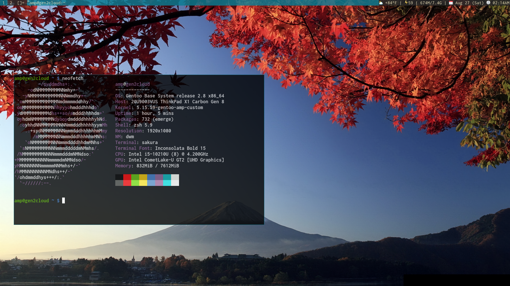

# My dwm build on Gentoo

I have applied the following patches to this dwm build:

* alpha patch (for transparency in the top bar)
* hide-vacant-tags (to hide the tags that are unused)
* full-gaps (for full proper gaps)

Note: 

In order to have color in the top bar you have to patch libXft
The link to the patch is here:
https://gitlab.freedesktop.org/xorg/lib/libxft/-/merge_requests/1.patch

Put the patch inside /etc/portage/patches/libxft/

Then re-emerge libXft accordingly:

`doas emerge --ask --verbose --newuse libXft`

The isCol function is still in drw.c, just commented out. I left it there in case I need to reference it later.

The status bar is handled by dwmblocks and is required for it to work as I have it on my machine.

The weather is retrieved through a simple shell script that runs `curl -s 'wttr.in/?format=1' | awk '{print $2}'` once per day. 

Heres a picture of how it looks:

